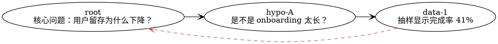

# ThoughtGraph · 思维图谱

一个用 **Rust + Tauri 2 + SQLite** 写的 macOS 桌面应用，把"评论 / 回复"建模成有向图，
并通过 **GraphViz** 渲染出来。

> 大脑里放不下太多节点 —— 把它们倒进图里，让思考可计算、可回溯、可成环。

---

## 1. 为什么做这个

- **多张图** —— 每个主题一张图，互不干扰。
- **评论 / 回复** —— 每个节点都可以被回复，自然形成树状的思考脉络。
- **app_id 引用形成"环"** —— 给节点起一个易记的 ID（如 `root`、`hypothesis-1`），
  在任意节点里通过 `⟲ Ref by app_id` 引用一个已存在的 ID，就会画出一条
  **回边**，让图形成环。对**回归型 / 递归型思考**特别有用：
  *A → B → C ⟲ A*，可以一眼看出"我又绕回来了"。
- **导出 `.gv` / 直接渲染** —— 一键导出 GraphViz 源文件，或调用 `dot`
  渲染成 PDF，再交给 `/Applications/Graphviz.app` 查看。
- **思维路径搜索** —— 输入两个 `app_id`，用 BFS 找出所有最短路径，
  把"从想法 A 到结论 B 是怎么走过来的"显式呈现。

---

## 2. 环境要求

| 依赖 | 说明 |
| --- | --- |
| macOS | 10.13+ |
| Xcode CLT | `xcode-select --install` |
| Rust | 1.77+（`cargo` 可用即可） |
| Node.js | 18+，用于跑 `@tauri-apps/cli` |
| GraphViz | `brew install graphviz`（`dot` 必须在 PATH 里），或装 `Graphviz.app` |

应用本身把 SQLite 静态链接进了二进制，**不需要额外安装 sqlite**。

---

## 3. 快速开始

```bash
cd /Users/xlisp/RustPro/graphviz-comment-reply
npm install          # 装 Tauri CLI
npm run dev          # 开发模式（首次约 3–5 分钟编译 Tauri 依赖树）
```

打包成可分发的 `.app` / `.dmg`：

```bash
npm run build
# 产物位于 target/release/bundle/
#   macos/ThoughtGraph.app
#   dmg/ThoughtGraph_0.1.0_*.dmg     （仅 GUI）
```

要打**同时包含 MCP server** 的 DMG（推荐，给 Claude Desktop 用）：

```bash
./scripts/build-dmg.sh
# 产物位于 dist/ThoughtGraph-<version>-<arch>.dmg
# .app 内嵌 thoughtgraph-mcp，安装后路径稳定：
#   /Applications/ThoughtGraph.app/Contents/Resources/bin/thoughtgraph-mcp
```

本地数据库存放位置：

```
~/Library/Application Support/com.chanshunli.thoughtgraph/thoughtgraph.sqlite3
```

导出的 `.gv` / `.pdf` 也在同目录的 `exports/` 子目录下。

---

## 4. 使用流程

### 4.1 新建图
左上角 **+** → 输入图名 → 创建。
图名可重复，但建议用主题区分（如 *Q2 战略复盘*）。

### 4.2 创建顶层评论（根节点）
左侧 **+ New comment** → 输入：
- **app_id**：图内唯一 ID，建议短而可记（如 `root`、`idea-1`、`risk-A`）。
- **Content**：正文，支持多行。

### 4.3 回复
选中一个节点 → 工具栏 **↳ Reply** → 填新节点的 `app_id` 和正文。
回复会在两节点之间生成一条 `kind='reply'` 的实线边。

### 4.4 引用已有节点（成环 ⟲）
选中一个节点 → 工具栏 **⟲ Ref by app_id** → 填**目标 app_id**（必须已存在于本图）。
- 生成一条 `kind='ref'` 的**虚线红色**边。
- 当目标 app_id 是当前节点的祖先时 —— **环形成**，这正是用于回归思考的关键。

### 4.5 导出 / 渲染
| 按钮 | 行为 |
| --- | --- |
| **Export .gv** | 在 `exports/<图名>.gv` 写入 DOT 源码，弹窗告诉你路径 |
| **Render → PDF** | 调用 `dot -Tpdf` 渲染并用系统默认应用打开 |
| **Open in Graphviz.app** | 导出 `.gv` 后用 `/Applications/Graphviz.app` 打开 |
| **Show DOT** | 在右下角实时显示当前图的 DOT 源码 |

### 4.6 路径搜索
右侧 **Thinking path search** 面板：
- 输入 *From app_id* 与 *To app_id*
- 点击 **Find shortest paths** → 返回最多 10 条最短路径
- 每条路径会标出每一步是 `↳ reply` 还是 `⟲ ref`，方便区分"自然展开"和"回边"。

---

## 5. 数据模型

```
graphs(id, name, description, created_at, updated_at)
nodes(id, graph_id, app_id, content, created_at)         -- UNIQUE(graph_id, app_id)
edges(id, graph_id, from_node_id, to_node_id, kind, label)
        kind ∈ {'reply', 'ref'}
```

- **reply** 边：父评论 → 子回复，构成"树骨架"。
- **ref** 边：任意节点 → 任意已存在节点，可形成环。
- 删除节点会级联删除其子树和相关边。

导出的 DOT 大致长这样：



---

## 6. 工程结构

```
graphviz-comment-reply/
├── package.json                # @tauri-apps/cli
├── src/                        # 前端（纯 HTML/CSS/JS，无构建步骤）
│   ├── index.html
│   ├── styles.css
│   └── main.js
└── src-tauri/                  # Rust + Tauri 2 后端
    ├── Cargo.toml
    ├── tauri.conf.json
    ├── build.rs
    ├── capabilities/default.json
    ├── icons/...
    └── src/
        ├── main.rs             # 入口
        ├── lib.rs              # Tauri Builder、插件注册、command 列表
        ├── db.rs               # SQLite schema 与 CRUD
        ├── graph.rs            # DOT 渲染、dot 进程调用、BFS 路径搜索
        └── commands.rs         # Tauri command 包装
```

---

## 7. 常见问题

**Q: 启动后报 `graphviz dot not found`?**
A: 先 `brew install graphviz`，或确认 `/usr/local/bin/dot`、`/opt/homebrew/bin/dot`
其中之一存在。

**Q: 我可以引用一个还没创建的 app_id 吗?**
A: 不行。引用边要求目标节点已存在。建议先把所有想法节点建好，再补引用。

**Q: 删除节点会断我的环吗?**
A: 会。删除会级联清掉所有指入 / 指出该节点的边。

**Q: 想换图标?**
A: 用你自己的 512×512 RGBA PNG 替换 `src-tauri/icons/icon.png`，然后重跑
`iconutil` 那一段生成 `icon.icns`。

**Q: 数据库怎么备份?**
A: 直接复制 `~/Library/Application Support/com.chanshunli.thoughtgraph/thoughtgraph.sqlite3`。

---

## 8. MCP server（图记忆中心）

`mcp-server/` 是一个独立的 Rust 二进制，把同一个 SQLite 数据库暴露为
**Model Context Protocol** server，让 Claude Desktop 当作长期记忆来用：

- 跨会话读写 / 搜索图谱
- 13 个工具：CRUD、`add_reference`（成环）、`search_nodes`（FTS5）、`find_paths`、`render_graph` 等
- 与 GUI app **共享同一份 SQLite**（已开启 WAL，并发安全）
- 自动维护 FTS5 全文索引（由触发器同步 `nodes` ↔ `nodes_fts`）

编译并接入 Claude Desktop：

```bash
cargo build -p thoughtgraph-mcp --release
```

把可执行文件路径写进 `~/Library/Application Support/Claude/claude_desktop_config.json`：

```json
{
  "mcpServers": {
    "thoughtgraph": {
      "command": "/Users/xlisp/RustPro/graphviz-comment-reply/target/release/thoughtgraph-mcp"
    }
  }
}
```

详见 [`mcp-server/README.md`](./mcp-server/README.md)。

## 9. License

MIT
